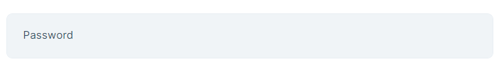
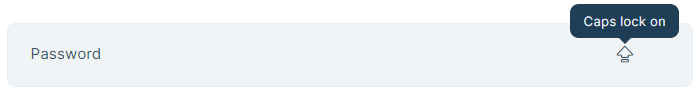

```json
//[doc-seo]
{
    "Description": "Learn how to implement the `TrackCapsLockDirective` for password inputs in Angular, enhancing user experience with Caps Lock warnings."
}
```

# Caps Lock Directive

In password inputs, You may want to show if Caps Lock is on. To make this even easier, you can use the `TrackCapsLockDirective` which has been exposed by the `@abp/ng.core` package.


## Getting Started

`TrackCapsLockDirective` is standalone. In order to use the `TrackCapsLockDirective` in an HTML template, import it to related component. The selector of the directive is **`abpCapsLock`**. By adding the `abpCapsLock` event to an element, you can track the status of Caps Lock. You can use this to warn user.

See an example usage:

```ts
import { TrackCapsLockDirective } from '@abp/ng.core'

@Component({
  selector: 'sample-component',
  template: `
    <div class="d-flex flex-column">
      <label>Password</label>
      <input (abpCapsLock)="capsLock = $event"/>
      @if (capslock) {
        <i>icon</i>
      }
    </div>
  `,
  imports: [TrackCapsLockDirective]
})
export class SampleComponent{
  capsLock = false;
}
```

The `abpCapsLock` event has been added to the `<input>` element. Press Caps Lock to activate the `TrackCapsLockDirective`.

See the result:



To see Caps Lock icon press Caps Lock.


