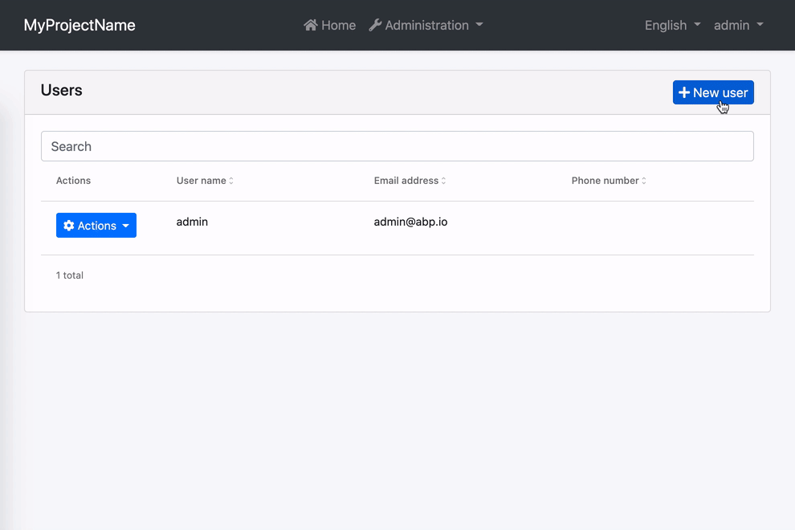
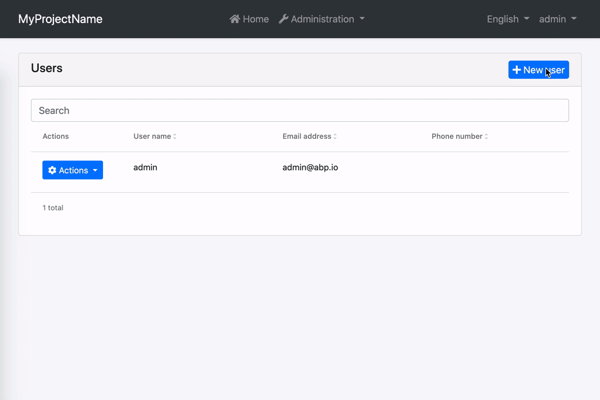

```json
//[doc-seo]
{
    "Description": "Learn how to easily implement form validation in ABP Angular UI using ngx-validate, with automatic error message handling for a seamless user experience."
}
```

# Form Validation

Reactive forms in ABP Angular UI are validated by [ngx-validate](https://www.npmjs.com/package/@ngx-validate/core) and helper texts are shown automatically based on validation rules and error blueprints. You do not have to add any elements or components to your templates. The library handles that for you. Here is how the experience is:


## How to Add New Error Messages

You can add a new error message by passing validation options to the `withValidationBluePrint` method inside `provideAbpThemeShared` function in your root application configuration.

```ts
import { provideAbpThemeShared, withValidationBluePrint } from '@abp/ng.theme.shared';

export const appConfig: ApplicationConfig = {
  providers: [
    // ...
    provideAbpThemeShared(
      withValidationBluePrint({
        uniqueUsername: "::AlreadyExists[]"
      })
    ),
    // ...
  ],
};
```

Alternatively, you may provide the `VALIDATION_BLUEPRINTS` token directly in your root configuration. Please do not forget to spread `DEFAULT_VALIDATION_BLUEPRINTS`. Otherwise, built-in ABP validation messages will not work.

```js
import { VALIDATION_BLUEPRINTS } from "@ngx-validate/core";
import { DEFAULT_VALIDATION_BLUEPRINTS } from "@abp/ng.theme.shared";

export const appConfig: ApplicationConfig = {
  providers: [
    {
      provide: VALIDATION_BLUEPRINTS,
      useValue: {
        ...DEFAULT_VALIDATION_BLUEPRINTS,
        uniqueUsername: "::AlreadyExists[]",
      },
    },

    // other providers
  ],
};
```

When a [validator](https://angular.io/guide/form-validation#defining-custom-validators) or an [async validator](https://angular.io/guide/form-validation#creating-asynchronous-validators) returns an error with the key given to the error blueprints (`uniqueUsername` here), the validation library will be able to display an error message after localizing according to the given key and interpolation params. The result will look like this:


In this example;

- Localization key is `::AlreadyExists`.
- The interpolation param is `username`.
- Localization resource is defined as `"AlreadyExists": "Sorry, “{0}” already exists."`.
- And the validator should return `{ uniqueUsername: { username: "admin" } }` as the error object.

## How to Change Existing Error Messages

You can overwrite an existing error message by passing validation options to the `provideAbpThemeShared` in your root application configuration. Let's imagine you have a custom localization resource for required inputs.

```json
"RequiredInput": "Oops! We need this input."
```

To use this instead of the built-in required input message, all you need to do is the following.

```ts
import { provideAbpThemeShared, withValidationBluePrint } from '@abp/ng.theme.shared';

export const appConfig: ApplicationConfig = {
  providers: [
     // ...
    provideAbpThemeShared(
      withValidationBluePrint({
        required: "::RequiredInput",
      })
    ),
    // ...
  ],
};
```

Alternatively, you may provide the `VALIDATION_BLUEPRINTS` token directly in your root app configuration. Please do not forget to spread `DEFAULT_VALIDATION_BLUEPRINTS`. Otherwise, built-in ABP validation messages will not work.

```js
import { VALIDATION_BLUEPRINTS } from "@ngx-validate/core";
import { DEFAULT_VALIDATION_BLUEPRINTS } from "@abp/ng.theme.shared";

export const appConfig: ApplicationConfig = {
  providers: [
    {
      provide: VALIDATION_BLUEPRINTS,
      useValue: {
        ...DEFAULT_VALIDATION_BLUEPRINTS,
        required: "::RequiredInput",
      },
    },

    // other providers
  ],
};
```

The error message will look like this:



## How to Disable Validation on a Form

If you want to validate a form manually, you can always disable automatic validation on it. All you need to do is place `skipValidation` on the form element.

```html
<form [formGroup]="form" skipValidation>
  <!-- form fields here -->
</form>
```

## How to Disable Validation on a Specific Field

Validation works on any element or component with a `formControl` or `formControlName` directive. You can disable automatic validation on a specific field by placing `skipValidation` on the input element or component.

```html
<input type="text" formControlName="name" skipValidation />
```

## How to Use a Custom Error Component

First, build a custom error component. Extending the existing `ValidationErrorComponent` would make it easier.

```js
import { LocalizationPipe } from "@abp/ng.core";
import { ValidationErrorComponent } from "@abp/ng.theme.basic";
import { CommonModule } from "@angular/common";
import { ChangeDetectionStrategy, Component } from "@angular/core";

@Component({
  selector: "app-validation-error",
  imports:[CommonModule, LocalizationPipe],
  template: `
    <div
      class="font-weight-bold font-italic px-1 invalid-feedback"
      *ngFor="let error of abpErrors; trackBy: trackByFn"
    >
      
    </div>
  `,
  changeDetection: ChangeDetectionStrategy.OnPush,
})
export class ErrorComponent extends ValidationErrorComponent {}
```

Then, provide it in your root configuration.

```js
import { VALIDATION_ERROR_TEMPLATE } from "@ngx-validate/core";

export const appConfig: ApplicationConfig = {
  providers: [
    // other providers
    {
      provide: VALIDATION_ERROR_TEMPLATE,
      useValue: ErrorComponent,
    },
  ],
};
```

The error message will be bold and italic now:



## How to Validate Nested Form Groups

There are multiple ways to validate nested form groups in ABP Angular UI. Below is the first and most common approach, using automatic validation and error messages with nested reactive forms. (A second method will be described in the next section.)

### 1st Way: Automatic Validation and Error Message Using Nested Reactive Forms

ABP Angular UI leverages Angular's reactive forms and the [ngx-validate](https://www.npmjs.com/package/@ngx-validate/core) library to provide a robust, flexible, and user-friendly form validation experience. Whether you build your forms manually or use ABP’s dynamic form generation features, validation and error messages are handled automatically.

#### Key Features

- **Automatic Validation:**  
  All validation rules defined in your DTOs (such as `[Required]`, `[StringLength]`, `[EmailAddress]`, etc.) are automatically reflected in the Angular form. Error messages are shown under each field without any extra markup.

- **Nested Form Groups and Dynamic Fields:**  
  For complex data structures, you can group fields or manage dynamic lists using nested `FormGroup` and `FormArray` structures. Validation and error display work seamlessly for both parent and child controls.

- **Dynamic and Extensible Forms:**  
  With ABP’s extensibility system, you can generate forms dynamically using helpers like `generateFormFromProps` and display them with the `abp-extensible-form` component. This ensures all entity properties (including extension properties) are included in the form and their validation rules are applied.

- **No Extra Boilerplate:**  
  You do not need to add custom error components or directives for validation. The system works out of the box, including for nested and dynamically generated controls.

#### Real-World Example: Nested Form Groups in the Users Form

Below is a real example from the Users management form in ABP Angular UI, showing how nested form structures and validation are implemented. This example includes both dynamically generated fields (with `abp-extensible-form`) and a dynamic list of roles using `FormArray` and `FormGroup`.

**TypeScript: Building the Form**

```ts
buildForm() {
  const data = new FormPropData(this.injector, this.selected);
  this.form = generateFormFromProps(data); // Automatically creates form controls from entity and extension properties

  this.service.getAssignableRoles().subscribe(({ items }) => {
    this.roles = items;
    if (this.roles) {
      // Dynamic roles list: nested FormArray and FormGroup
      this.form.addControl(
        'roleNames',
        this.fb.array(
          this.roles.map(role =>
            this.fb.group({
              [role.name as string]: [
                this.selected?.id
                  ? !!this.selectedUserRoles?.find(userRole => userRole.id === role.id)
                  : role.isDefault,
              ],
            }),
          ),
        ),
      );
    }
  });
}
```

**HTML: Displaying the Form**

```html
<abp-modal [(visible)]="isModalVisible" [busy]="modalBusy">
  <ng-template #abpHeader>
    <h3></h3>
  </ng-template>

  <ng-template #abpBody>
    @if (form) {
      <form [formGroup]="form" (ngSubmit)="save()">
        <ul ngbNav #nav="ngbNav" class="nav-tabs">
          <li ngbNavItem>
            <a ngbNavLink></a>
            <ng-template ngbNavContent>
              <!-- Automatically displays all entity fields and their validation -->
              <abp-extensible-form [selectedRecord]="selected"></abp-extensible-form>
            </ng-template>
          </li>

          <li ngbNavItem>
            <a ngbNavLink></a>
            <ng-template ngbNavContent>
              <!-- Dynamic roles list: nested FormArray and FormGroup -->
              @for (roleGroup of roleGroups; track $index; let i = $index) {
                <div class="form-check mb-2">
                  <abp-checkbox
                    [formControl]="roleGroup.controls[roles[i].name]"
                    [label]="roles[i].name"
                  ></abp-checkbox>
                </div>
              }
            </ng-template>
          </li>
        </ul>
        <div class="mt-2 fade-in-top" [ngbNavOutlet]="nav"></div>
      </form>
    } @else {
      <div class="text-center"><i class="fa fa-pulse fa-spinner" aria-hidden="true"></i></div>
    }
  </ng-template>
</abp-modal>
```

**Explanation:**
- `abp-extensible-form` automatically generates and displays all entity fields and their validation.
- In the Roles tab, each role is represented by a checkbox, and these checkboxes are managed in a `FormArray`, with each as a `FormGroup`. This is a real-world example of a nested form structure.
- All validation and error messages are shown automatically for both the main form and nested groups.


### 2nd Way: Manual Nested Reactive Forms Without abp-extensible-form

You can also build and validate nested form groups manually, without using `abp-extensible-form` or dynamic helpers. This approach gives you full control over the form structure and is useful for custom or non-entity-based forms.

#### Example: Simple Manual Nested FormGroup

Below is a simple, generic example of a nested reactive form. This form includes a nested `FormGroup` for profile information and demonstrates how to apply validation rules.

**TypeScript: Building the Form**

```ts
import { Component, OnInit, inject } from '@angular/core';
import { FormBuilder, FormGroup, Validators } from '@angular/forms';
import { NgxValidateCoreModule } from '@ngx-validate/core';

@Component({
  selector: 'app-nested-form',
  templateUrl: './nested-form.component.html',
  standalone: true,
  imports: [NgxValidateCoreModule],
})
export class NestedFormComponent implements OnInit {
  form: FormGroup;

  private fb = inject(FormBuilder);

  ngOnInit() {
    this.buildForm();
  }

  buildForm() {
    this.form = this.fb.group({
      userName: ['', Validators.required],
      email: ['', [Validators.required, Validators.email]],
      profile: this.fb.group({
        firstName: ['', Validators.required],
        lastName: ['', Validators.required],
      }),
    });
  }

  submit() {
    if (this.form.invalid) {
      return;
    }
    // handle submit
  }
}
```

**HTML: Displaying the Form**

```html
<form [formGroup]="form" (ngSubmit)="submit()">
  <div class="mb-3">
    <label class="form-label">User Name</label>
    <input type="text" class="form-control" formControlName="userName" />
  </div>

  <div class="mb-3">
    <label class="form-label">Email</label>
    <input type="email" class="form-control" formControlName="email" />
  </div>

  <div formGroupName="profile" class="card mt-3">
    <div class="card-header">
      <strong>Profile Details</strong>
    </div>
    <div class="card-body">
      <div class="mb-3">
        <label class="form-label">First Name</label>
        <input type="text" class="form-control" formControlName="firstName" />
      </div>

      <div class="mb-3">
        <label class="form-label">Last Name</label>
        <input type="text" class="form-control" formControlName="lastName" />
      </div>
    </div>
  </div>

  <hr class="my-3" />

  <div>
    <abp-button buttonType="submit" iconClass="fa fa-save" [disabled]="form.invalid">
      Save
    </abp-button>
  </div>
</form>
```

**How it works:**
- The form contains main fields (`userName`, `email`) and a nested `FormGroup` (`profile`).
- The `profile` group includes `firstName` and `lastName` fields, each with their own validation rules.
- Validation rules are defined directly in the form builder.
- Error messages and validation feedback are handled automatically by ngx-validate and ABP Angular UI, just like with dynamic forms.
- This structure ensures that validation works automatically for both the main form and nested groups.

> **Note:** This approach is ideal for custom forms or when you want full control over the form structure. It provides a user experience and validation behavior similar to ABP's dynamic forms, but with manual control over the form layout and logic.

---