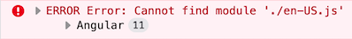

```json
//[doc-seo]
{
  "Description": "Learn how to effectively implement localization in your ABP Framework project using the Localization Pipe and Service for seamless multilingual support."
}
```

# Localization

Before exploring _the localization pipe_ and _the localization service_, you should go over the localization keys.

The localization key format consists of two sections which are **Resource Name** and **Key**.
`ResourceName::Key`

> If you do not specify the resource name, the `defaultResourceName` which is declared in `environment.ts` will be considered as default.

```ts
const environment = {
  // ...
  localization: {
    defaultResourceName: "MyProjectName",
  },
};
```

So, these two will give the same results:

```html
<h1></h1>

<h1></h1>
```

## Using the Localization Pipe

You can use the `abpLocalization` pipe to get localized text as in this example:

```html
<h1></h1>
```

This pipe will replace the key with the localized text.

You can also specify a default value as shown below:

```html
<h1>
  
</h1>
```

In order to use the interpolation, you must give the parameters for the pipe, as an example:

Localization data is stored in key-value pairs:

```ts
{
  // ...
  AbpAccount: { // AbpAccount is the resource name
    Key: "Value",
    PagerInfo: "Showing {0} to {1} of {2} entries"
  }
}
```

Then, we can use this key like this:

```html
<h1></h1>

<!-- Output: Showing 20 to 30 of 50 entries -->
```

### Using the Localization Service

First of all, you should import the `LocalizationService` from **@abp/ng.core**

```js
import { LocalizationService } from '@abp/ng.core';
import { inject } from '@angular/core';

class MyClass {
  private localizationService = inject(LocalizationService);
}
```

After that, you will be able to use the localization service.

> You can add interpolation parameters as arguments to `instant()` and `get()` methods.

```ts
this.localizationService.instant(
  "AbpIdentity::UserDeletionConfirmation",
  "John"
);

// with fallback value
this.localizationService.instant(
  {
    key: "AbpIdentity::UserDeletionConfirmation",
    defaultValue: "Default Value",
  },
  "John"
);

// Output
// User 'John' will be deleted. Do you confirm that?
```

To get a localized text as [_Observable_](https://rxjs.dev/guide/observable) use `get` method instead of `instant`:

```ts
this.localizationService.get("Resource::Key");

// with fallback value
this.localizationService.get({
  key: "Resource::Key",
  defaultValue: "Default Value",
});
```

## UI Localizations

Localizations can be determined on the backend side. Therefore, Angular UI gets the localization resources from the `application-localization` API's response then merges these resources with `configuration state` in [`ConfigStateService`](config-state-service.md). You can also determine localizations on the UI side.

See an example:

```ts
import { provideAbpCore, withOptions } from "@abp/ng.core";

export const appConfig: ApplicationConfig = {
  providers: [
    // ...
    provideAbpCore(
      withOptions({
        // ...,
        localizations: [
          {
            culture: "en",
            resources: [
              {
                resourceName: "MyProjectName",
                texts: {
                  Administration: "Administration",
                  HomePage: "Home",
                },
              },
            ],
          },
          {
            culture: "de",
            resources: [
              {
                resourceName: "MyProjectName",
                texts: {
                  Administration: "Verwaltung",
                  HomePage: "Startseite",
                },
              },
            ],
          },
        ],
      })
    ),
  ],
};
```

You can also declare the localizations in a feature provider configuration:

```ts
// your feature configuration

export function provideFeatureConfiguration(): EnvironmentProviders {
  return provideAbpCoreChild({
    localizations: [
      {
        culture: "en",
        resources: [
          {
            resourceName: "MyProjectName",
            texts: {
              Administration: "Administration",
              HomePage: "Home",
            },
          },
        ],
      },
      {
        culture: "de-DE",
        resources: [
          {
            resourceName: "MyProjectName",
            texts: {
              Administration: "Verwaltung",
              HomePage: "Startseite",
            },
          },
        ],
      },
    ],
  });
}
```

The localizations above can be used like this:

```html
<div></div>

<div></div>
```

> **Note:** If you have specified the same localizations in the UI and backend, the backend localizations override the UI localizations.

## RTL Support

As of v2.9 ABP supports RTL. If you are generating a new project with v2.9 and above, everything is set, there is no need to make any changes. If you are migrating your project from an earlier version, please follow the 2 steps below:

### Step 1. Create Chunks for Bootstrap LTR and RTL

Find [styles configuration in angular.json](https://angular.io/guide/workspace-config#style-script-config) and make sure the chunks in your project has `bootstrap-rtl.min` and `bootstrap-ltr.min` as shown below.

```json
{
  "projects": {
    "MyProjectName": {
      "architect": {
        "build": {
          "options": {
            "styles": [
              {
                "input": "node_modules/@fortawesome/fontawesome-free/css/all.min.css",
                "inject": true,
                "bundleName": "fontawesome-all.min"
              },
              {
                "input": "node_modules/@fortawesome/fontawesome-free/css/v4-shims.min.css",
                "inject": true,
                "bundleName": "fontawesome-v4-shims.min"
              },
              {
                "input": "node_modules/@abp/ng.theme.shared/styles/bootstrap-rtl.min.css",
                "inject": false,
                "bundleName": "bootstrap-rtl.min"
              },
              {
                "input": "node_modules/bootstrap/dist/css/bootstrap.min.css",
                "inject": true,
                "bundleName": "bootstrap-ltr.min"
              },
              "apps/dev-app/src/styles.scss"
            ]
          }
        }
      }
    }
  }
}
```

### Step 2. Clear Lazy Loaded Fontawesome in AppComponent

If you have created and injected chunks for Fontawesome as seen above, you no longer need the lazy loading in the `AppComponent` which was implemented before v2.9. Simply remove them. The `AppComponent` in the template of the new version looks like this:

```ts
import { Component } from "@angular/core";

@Component({
  selector: "app-root",
  template: `
    <abp-loader-bar />
    <router-outlet />
  `,
})
export class AppComponent {}
```

## Registering a New Locale

Since ABP has more than one language, Angular locale files load lazily using [Webpack's import function](https://webpack.js.org/api/module-methods/#import-1) to avoid increasing the bundle size and to register the Angular core using the [`registerLocaleData`](https://angular.io/api/common/registerLocaleData) function. The chunks to be included in the bundle are specified by the [Webpack's magic comments](https://webpack.js.org/api/module-methods/#magic-comments) as hard-coded. Therefore a `registerLocale` function that returns Webpack `import` function must be passed to `provideAbpCore(withOptions({...}))`.

### registerLocaleFn

The `registerLocale` function, exported from the `@abp/ng.core/locale` package, is a **higher-order function**.

It accepts the following parameters:

- **`cultureNameLocaleFileMap`** – an object that maps culture names to their corresponding locale files.
- **`errorHandlerFn`** – a function that handles any errors that occur during locale loading.

It returns a **Webpack `import` function**.

You should use `registerLocale` within the `withOptions` function of `provideAbpCore`, as shown in the example below:

```ts
import { provideAbpCore, withOptions } from "@abp/ng.core";
import { registerLocale } from "@abp/ng.core/locale";

export const appConfig: ApplicationConfig = {
  providers: [
    // ...
    provideAbpCore(
      withOptions({
        // ...,
        registerLocaleFn: registerLocale(
          // you can pass the cultureNameLocaleFileMap and errorHandlerFn as optionally
          {
            cultureNameLocaleFileMap: { "pt-BR": "pt" },
            errorHandlerFn: ({ resolve, reject, locale, error }) => {
              // the error can be handled here
            },
          }
        ),
      })
    ),
    // ...
  ],
};
```

### Mapping of Culture Name to Angular Locale File Name

Some of the culture names defined in .NET do not match Angular locales. In such cases, the Angular app throws an error like below at runtime:



If you see an error like this, you should pass the `cultureNameLocaleFileMap` property like below to the `registerLocale` function.

```ts
// app.config.ts

import { registerLocale } from "@abp/ng.core/locale";
// if you have commercial license and the language management module, add the below import
// import { registerLocale } from '@volo/abp.ng.language-management/locale';

export const appConfig: ApplicationConfig = {
  providers: [
    // ...
    provideAbpCore(
      withOptions({
        // ...,
        registerLocaleFn: registerLocale({
          cultureNameLocaleFileMap: {
            DotnetCultureName: "AngularLocaleFileName",
            "pt-BR": "pt", // example
          },
        }),
      })
    ),
  ],
};
```

See [all locale files in Angular](https://github.com/angular/angular/tree/master/packages/common/locales).

### Adding a New Culture

If you want to register a new language, you can add the code below to the `app.config.ts` by replacing `your-locale` placeholder with a correct locale name.

```ts
//app.config.ts

import { storeLocaleData } from "@abp/ng.core/locale";
import(
  /* webpackChunkName: "_locale-your-locale-js"*/
  /* webpackMode: "eager" */
  "@angular/common/locales/your-locale.js"
).then((m) => storeLocaleData(m.default, "your-locale"));
```

You can also configure a custom `registerLocale` function that can be passed to the abp core provider configuration options:

```ts
// register-locale.ts

import { differentLocales } from "@abp/ng.core";
export function registerLocale(locale: string) {
  return import(
    /* webpackChunkName: "_locale-[request]"*/
    /* webpackInclude: /[/\\](en|fr).js/ */
    /* webpackExclude: /[/\\]global|extra/ */
    `@angular/common/locales/${differentLocales[locale] || locale}.js`
  );
}

// app.config.ts

import { registerLocale } from "./register-locale";

export const appConfig: ApplicationConfig = {
  providers: [
    // ...
    provideAbpCore(
      withOptions({
        // ...,
        registerLocaleFn: registerLocale,
      })
    ),
    //...
  ],
};
```

After adding a custom `registerLocale` function, only the **`en`** and **`fr`** locale files will be created as separate chunks.  
This happens because only these locales are included in the **`webpackInclude`** configuration.


The locale files that you added to the `webpackInclude` magic comment will be included in the bundle.

## See Also

- [Localization in ASP.NET Core](../../fundamentals/localization.md)
- [Video tutorial](https://abp.io/video-courses/essentials/localization)
