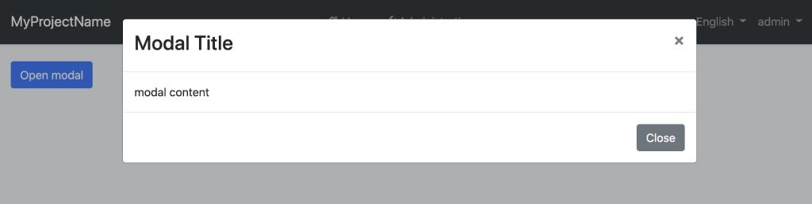
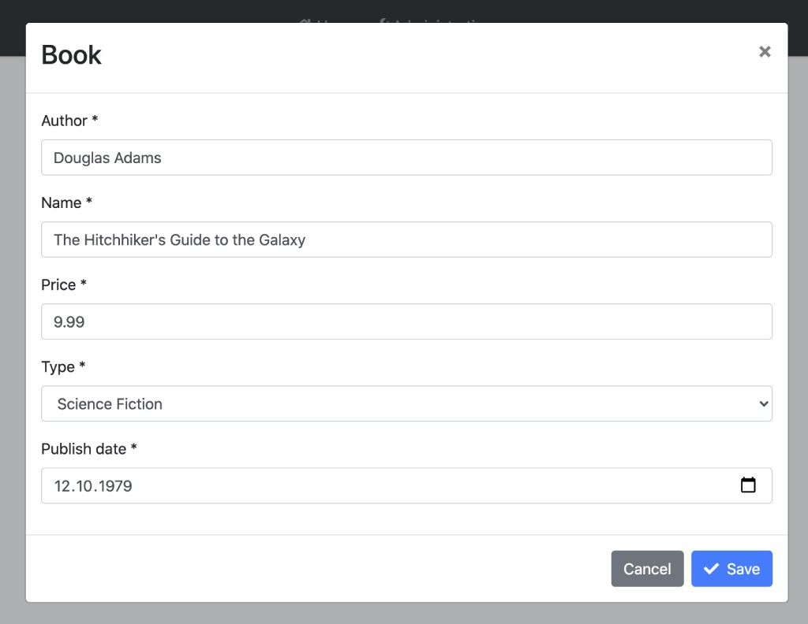
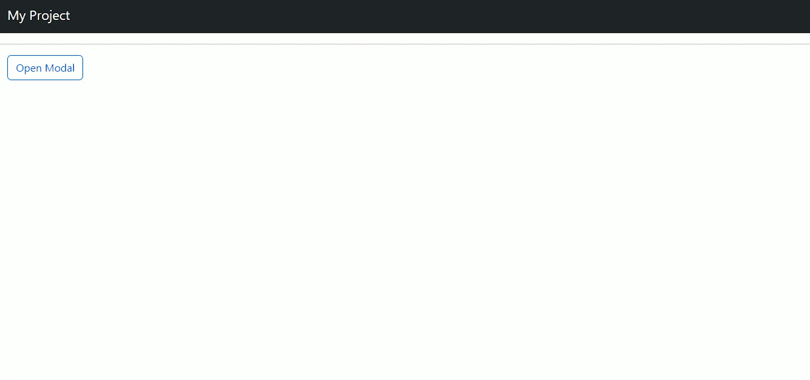
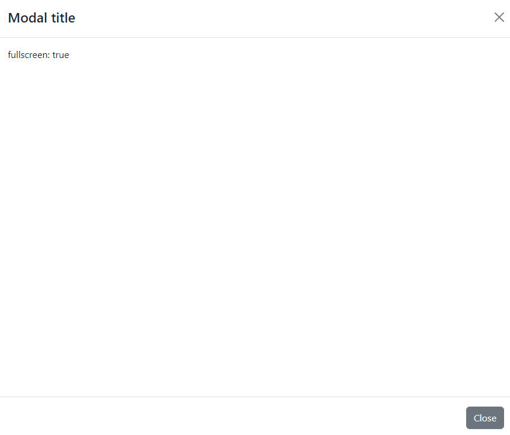

```json
//[doc-seo]
{
    "Description": "Learn how to utilize the flexible `ModalComponent` from ABP Framework for customizable modals with seamless integration and user-friendly features."
}
```

# Modal

`ModalComponent` is a pre-built component exposed by `@abp/ng.theme.shared` package to show modals. The component uses the [`ng-bootstrap`](https://ng-bootstrap.github.io/)'s modal service inside to render a modal. 

The `abp-modal` provides some additional benefits:
 
 - It is **flexible**. You can pass header, body, footer templates easily by adding the templates to the `abp-modal` content. It can also be implemented quickly.
 - Provides several inputs be able to customize the modal and several outputs be able to listen to some events.
 - Automatically detects the close button which has a `abpClose` directive attached to and closes the modal when pressed this button.
 - Automatically detects the `abp-button` and triggers its loading spinner when the `busy` input value of the modal component is true.
 - Automatically checks if the form inside the modal **has changed, but not saved**. It warns the user by displaying a [confirmation popup](confirmation-service.md) in this case when a user tries to close the modal or refresh/close the tab of the browser.


> Note: A modal can also be rendered by using the `ng-bootstrap` modal. For further information, see [Modal doc](https://ng-bootstrap.github.io/#/components/modal) on the `ng-bootstrap` documentation.

## Getting Started

In order to use the `abp-modal` in an HTML template, the **`ModalComponent`** should be imported into your component like this:

```js
// sample.component.ts
// ...
import { ModalComponent, ModalCloseDirective } from '@abp/ng.theme.shared';

@Component({
  //...
  ,
  imports: [
    // ..., 
    ModalComponent,
    ModalCloseDirective // if you use `abpClose` directive in the html template
  ],
})
export class SampleComponent {
  isModalOpen = false;
}
```

```html
<!-- sample.component.html -->

<button class="btn btn-primary" (click)="isModalOpen = true">
  Open modal
</button>

<abp-modal [(visible)]="isModalOpen">
  <ng-template #abpHeader>
    <h3>Modal Title</h3>
  </ng-template>

  <ng-template #abpBody>
    <p>Modal content</p>
  </ng-template>

  <ng-template #abpFooter>
    <button type="button" class="btn btn-secondary" abpClose>
      Close
    </button>
  </ng-template>
</abp-modal>
```




See an example form inside a modal:

```html
<!-- book.component.ts -->

<abp-modal [(visible)]="isModalOpen" [busy]="inProgress">
  <ng-template #abpHeader>
    <h3>Book</h3>
  </ng-template>

  <ng-template #abpBody>
    <form id="book-form" [formGroup]="form" (ngSubmit)="save()">
      <div class="form-group">
        <label for="book-name">Author</label><span> * </span>
        <input type="text" id="author" class="form-control" formControlName="author" autofocus />
      </div>

      <div class="form-group">
        <label for="book-name">Name</label><span> * </span>
        <input type="text" id="book-name" class="form-control" formControlName="name" />
      </div>

      <div class="form-group">
        <label for="book-price">Price</label><span> * </span>
        <input type="number" id="book-price" class="form-control" formControlName="price" />
      </div>

      <div class="form-group">
        <label for="book-type">Type</label><span> * </span>
        <select class="form-control" id="book-type" formControlName="type">
          <option [ngValue]="null">Select a book type</option>
          <option [ngValue]="0">Undefined</option>
          <option [ngValue]="1">Adventure</option>
          <option [ngValue]="2">Biography</option>
          <option [ngValue]="3">Fantastic</option>
          <option [ngValue]="4">Science</option>
        </select>
      </div>

      <div class="form-group">
        <label for="book-publish-date">Publish date</label><span> * </span>
        <input
          id="book-publish-date"
          formControlName="publishDate"
          class="form-control"
          type="date"
        />
      </div>
    </form>
  </ng-template>

  <ng-template #abpFooter>
    <button type="button" class="btn btn-secondary" abpClose>
      Cancel
    </button>

    <button form="book-form" class="btn btn-primary" [disabled]="form.invalid || form.pristine">
      <i class="fa fa-check mr-1"></i>
      Save
    </button>
  </ng-template>
</abp-modal>
```

```ts
// book.component.ts

import { Component } from '@angular/core';
import { FormBuilder, Validators } from '@angular/forms';
import { inject } from '@angular/core';

@Component(/* component metadata */)
export class BookComponent {
  private fb = inject(FormBuilder);
  private service = inject(BookService);
  form = this.fb.group({
    author: [null, [Validators.required]],
    name: [null, [Validators.required]],
    price: [null, [Validators.required, Validators.min(0)]],
    type: [null, [Validators.required]],
    publishDate: [null, [Validators.required]],
  });

  inProgress: boolean;
  isModalOpen: boolean;

  save() {
    if (this.form.invalid) {
      return;
    }

    this.inProgress = true;

    this.service.save(this.form.value).subscribe(() => {
      this.inProgress = false;
    });
  }
}
```

The modal with form looks like this:



## API

### Inputs

#### visible

```js
@Input() visible: boolean
```

**`visible`** is a boolean input that controls whether the modal is open.

Important details:

- Default value: `false` (the modal is closed initially).
- Required binding: You must bind `visible` to a component property. If you omit it completely, the modal will never appear because it is only instantiated when `visible` becomes `true`.
- Two-way binding recommended: The component emits `visibleChange` when it needs to close (e.g., user presses the close button or backdrop). For this reason, using a constant like `[visible]="true"` or `visible="true"` is not supported—Angular cannot update a literal, so the modal cannot properly close and this may lead to an error. Always bind to a variable.
- Correct patterns:
  - Preferred shorthand: `[(visible)]="isModalOpen"`
  - Or explicit form: `[visible]="isModalOpen" (visibleChange)="isModalOpen = $event"`

Example (already shown above):

```html
<abp-modal [(visible)]="isModalOpen">
  <!-- content -->
</abp-modal>
```

Programmatic control:

```ts
// In your component class
isModalOpen = false;

open() { this.isModalOpen = true; }
close() { this.isModalOpen = false; }
```

Avoid (incorrect):

```html
<!-- This will open once but cannot close properly and may throw an error -->
<abp-modal [visible]="true"></abp-modal>
```

#### busy

```js
@Input() busy: boolean
```

**`busy`** is a boolean input that determines whether the busy status of the modal is true. When `busy` is true, the modal cannot be closed and the `abp-button` loading spinner is triggered.


#### options

```js
@Input() options: NgbModalOptions
```

**`options`** is an input typed [NgbModalOptions](https://ng-bootstrap.github.io/#/components/modal/api#NgbModalOptions). It is configuration for the `ng-bootstrap` modal.


**Examples:**

- `animation`: This is an NgbModalOption property of type *boolean*. It controls whether the modal opens and closes with an animation. By default, it is set to true, meaning that the modal will have a smooth transition when it opens and closes. Setting it to false will disable these animations.

```js
import { Component } from '@angular/core';
import { NgbModal } from '@ng-bootstrap/ng-bootstrap';

@Component({
  selector: 'ngbd-modal-options',
  ...})

export class NgbdModalOptions {
  modalService = inject(NgbModal);
  animationModal(content) {
    this.modalService.open(content, { animation: true });
  }
}
```

&nbsp;&nbsp;&nbsp;&nbsp;&nbsp;&nbsp; The result of this configuration would be like this:


&nbsp;&nbsp;&nbsp;&nbsp;&nbsp;&nbsp; On the contrary, if we set it as false:




- `fullscreen`: This is an NgbModalOption property of type *boolean or string*. When set to `true`, the element will expand to cover the entire screen, hiding all other interface elements. When set to `false`, the element remains in its regular size and position within the page.

```js
import { Component } from '@angular/core';
import { NgbModal } from '@ng-bootstrap/ng-bootstrap';

@Component({
 selector: 'ngbd-modal-options',
 ...})

export class NgbdModalOptions {
 modalService = inject(NgbModal);
 fullscreenModal(content) {
   this.modalService.open(content, { fullscreen: true });
 }
}

```

&nbsp;&nbsp;&nbsp;&nbsp;&nbsp;&nbsp; If `fullscreen: true`:



#### suppressUnsavedChangesWarning

```js
@Input() suppressUnsavedChangesWarning: boolean
```

**`suppressUnsavedChangesWarning`** is a boolean input that determines whether the confirmation popup triggering active or not. It can also be set globally as shown below:

```ts
// app.config.ts

import { SUPPRESS_UNSAVED_CHANGES_WARNING } from '@abp/ng.theme.shared';

export const appConfig: ApplicationConfig = {
  providers: [
    // ...
    { provide: SUPPRESS_UNSAVED_CHANGES_WARNING, useValue: true }
  ],
};
```

Note: The `suppressUnsavedChangesWarning` input of `abp-modal` value overrides the `SUPPRESS_UNSAVED_CHANGES_WARNING` injection token value.

### Outputs

#### visibleChange

```js
@Output() readonly visibleChange = new EventEmitter<boolean>();
```

**`visibleChange`** is an event emitted when the modal visibility has changed. The event payload is a boolean.

#### appear

```js
  @Output() readonly appear = new EventEmitter<void>();
```

**`appear`** is an event emitted when the modal has opened.

#### disappear

```js
  @Output() readonly disappear = new EventEmitter<void>();
```

**`disappear`** is an event emitted when the modal has closed.
