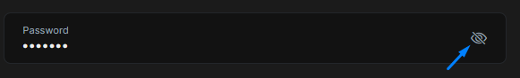
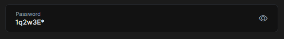

```json
//[doc-seo]
{
    "Description": "Easily enhance password inputs with the Show Password Directive from ABP Framework, allowing users to toggle visibility for better usability."
}
```

# Show Password Directive

In password input, text can be shown easily via changing input type attribute to `text`. To make this even easier, you can use the `ShowPasswordDirective` which has been exposed by the `@abp/ng.core` package.


## Getting Started
`ShowPasswordDirective` is standalone. In order to use the it in an HTML template, import it to your component:

**Importing to Component**
```ts
import { ShowPasswordDirective } from '@abp/ng.core';

@Component({
  //...
  imports: [
   // ...,
   ShowPasswordDirective
  ],
})
export class TestComponent {}
```

## Usage

The `ShowPasswordDirective` is very easy to use. The directive's selector is **`abpShowPassword`**. By adding the `abpShowPassword` attribute to an input element, you can activate the `ShowPasswordDirective` for the input element.

See an example usage:

```ts
import { ShowPasswordDirective } from '@abp/ng.core';
@Component({
  selector: 'sample-component',
  template: `
    <div class="d-flex flex-column">
      <label>Password</label>
      <input [abpShowPassword]="showPassword"/>
      <i (click)="showPassword = !showPassword">icon</i>
    </div>
  `,
  imports: [ShowPasswordDirective]
})
export class SampleComponent{
  showPassword = false;
}
```

The `abpShowPassword` attribute has been added to the `<input>` element. Click icon to activate the `ShowPasswordDirective`.

See the result:



To see password input click icon.


