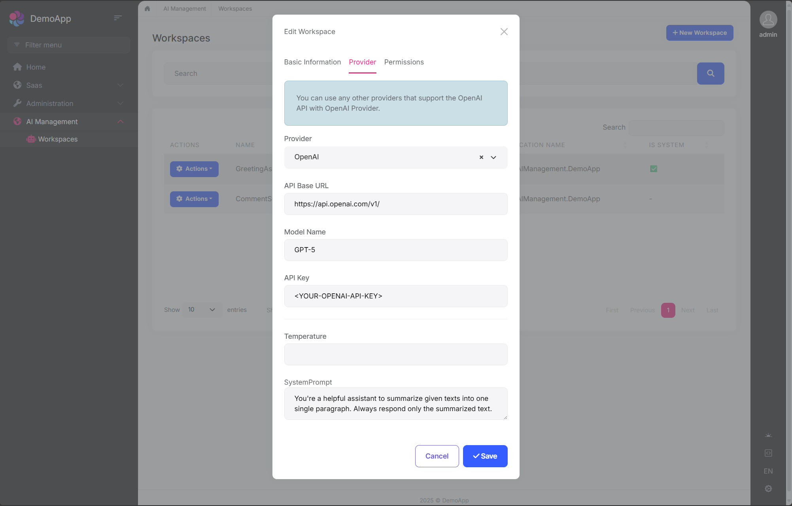

# AI Management (Pro)

> You must have an ABP Team or a higher license to use this module.

This module implements AI (Artificial Intelligence) management capabilities on top of the [Artificial Intelligence Workspaces](../../framework/infrastructure/artificial-intelligence.md) feature of the ABP Framework and allows to manage workspaces dynamically from the application including UI components and API endpoints.


## How to Install

AI Management module is not pre-installed in [the startup templates](../solution-templates/layered-web-application). You can install it using the ABP CLI or ABP Studio.

**Using ABP CLI:**

```bash
abp add-module Volo.AIManagement
```

**Using ABP Studio:**

Open ABP Studio, navigate to your solution explorer, **Right Click** on the project and select **Import Module**. Choose `Volo.AIManagement` from `NuGet` tab and check the "Install this Module" checkbox. Click the "OK" button to install the module.


## Packages

This module follows the [module development best practices guide](../../framework/architecture/best-practices) and consists of several NuGet and NPM packages. See the guide if you want to understand the packages and relations between them.

You can visit [AI Management module package list page](https://abp.io/packages?moduleName=Volo.AIManagement) to see list of packages related with this module.

AI Management module packages are designed for various usage scenarios. Packages are grouped by the usage scenario as `Volo.AIManagement.*` and `Volo.AIManagement.Client.*`. This structure helps to separate the use-cases clearly.

## User Interface

### Menu Items

AI Management module adds the following items to the "Main" menu, under the "Administration" menu item:

* **Workspaces**: Workspace management page.
* **Chat**: AI chat interface for testing workspaces.

`AIManagementMenus` class has the constants for the menu item names.

### Pages

#### Workspace Management

Workspaces page is used to manage AI workspaces in the system. You can create, edit, duplicate, and delete workspaces.



You can create a new workspace or edit an existing workspace in this page. The workspace configuration includes:

* **Name**: Unique identifier for the workspace (cannot contain spaces)
* **Provider**: AI provider (OpenAI, Ollama, or custom providers)
* **Model**: AI model name (e.g., gpt-4, mistral)
* **API Key**: Authentication key (if required by provider)
* **API Base URL**: Custom endpoint URL (optional)
* **System Prompt**: Default system instructions
* **Temperature**: Response randomness (0.0-1.0)
* **Application Name**: Associate with specific application
* **Required Permission**: Permission needed to use this workspace

#### Chat Interface

The AI Management module includes a built-in chat interface for testing workspaces. You can:

* Select a workspace from available workspaces
* Send messages and receive AI responses
* Test streaming responses
* Verify workspace configuration before using in production

> Access the chat interface at: `/AIManagement/Chat`

## Workspace Configuration

Workspaces are the core concept of the AI Management module. A workspace represents an AI provider configuration that can be used throughout your application.

### Workspace Properties

When creating or managing a workspace, you can configure the following properties:

| Property | Required | Description |
|----------|----------|-------------|
| `Name` | Yes | Unique workspace identifier (cannot contain spaces) |
| `Provider` | Yes* | AI provider name (e.g., "OpenAI", "Ollama") |
| `ModelName` | Yes* | Model identifier (e.g., "gpt-4", "mistral") |
| `ApiKey` | No | API authentication key (required by some providers) |
| `ApiBaseUrl` | No | Custom endpoint URL (defaults to provider's default) |
| `SystemPrompt` | No | Default system prompt for all conversations |
| `Temperature` | No | Response randomness (0.0-1.0, defaults to provider default) |
| `Description` | No | Workspace description |
| `IsActive` | No | Enable/disable the workspace (default: true) |
| `ApplicationName` | No | Associate workspace with specific application |
| `RequiredPermissionName` | No | Permission required to use this workspace |
| `IsSystem` | No | Whether it's a system workspace (read-only) |
| `OverrideSystemConfiguration` | No | Allow database configuration to override code-defined settings |

**\*Not required for system workspaces**

### System vs Dynamic Workspaces

The AI Management module supports two types of workspaces:

#### System Workspaces

* **Defined in code** using `PreConfigure<AbpAIWorkspaceOptions>`
* **Cannot be deleted** through the UI
* **Read-only by default**, but can be overridden when `OverrideSystemConfiguration` is enabled
* **Useful for** application-critical AI features that must always be available
* **Created automatically** when the application starts

Example:

```csharp
PreConfigure<AbpAIWorkspaceOptions>(options =>
{
    options.Workspaces.Configure<MyAssistantWorkspace>(configuration =>
    {
        configuration.ConfigureChatClient(chatClientConfiguration =>
        {
            chatClientConfiguration.Builder = new ChatClientBuilder(
                sp => new OpenAIClient(apiKey).GetChatClient("gpt-4")
            );
        });
    });
});
```

#### Dynamic Workspaces

* **Created through the UI** or programmatically via `IWorkspaceRepository`
* **Fully manageable** - can be created, updated, activated/deactivated, and deleted
* **Stored in database** with all configuration
* **Ideal for** user-customizable AI features

Example (data seeding):

```csharp
await _workspaceRepository.InsertAsync(new Workspace(
    name: "CustomerSupportWorkspace",
    provider: "OpenAI",
    modelName: "gpt-4",
    apiKey: "your-api-key",
    systemPrompt: "You are a helpful customer support assistant.",
    requiredPermissionName: "MyApp.CustomerSupport"
));
```

### Workspace Naming Rules

* Workspace names **must be unique**
* Workspace names **cannot contain spaces** (use underscores or camelCase)
* Workspace names are **case-sensitive**

## Permissions

The AI Management module defines the following permissions:

### Workspace Management Permissions

| Permission | Description | Default Granted To |
|------------|-------------|-------------------|
| `AIManagement.Workspaces` | View workspaces | Admin role |
| `AIManagement.Workspaces.Create` | Create new workspaces | Admin role |
| `AIManagement.Workspaces.Update` | Edit existing workspaces | Admin role |
| `AIManagement.Workspaces.Delete` | Delete workspaces | Admin role |

### Chat Permissions

| Permission | Description | Default Granted To |
|------------|-------------|-------------------|
| `AIManagement.Chat` | Access chat interface | Admin role |

### Workspace-Level Permissions

In addition to module-level permissions, you can restrict access to individual workspaces by setting the `RequiredPermissionName` property:

```csharp
var workspace = new Workspace(
    name: "PremiumWorkspace",
    provider: "OpenAI",
    modelName: "gpt-4",
    requiredPermissionName: "MyApp.PremiumFeatures"
);
```

When a workspace has a required permission:
* Only users with that permission can access the workspace
* Users without the permission will receive an authorization error
* The workspace will not appear in the workspace selection dropdown for unauthorized users

## Usage Scenarios

The AI Management module is designed to support various usage patterns, from simple standalone AI integration to complex microservice architectures. The module provides two main package groups to support different scenarios:

- **`Volo.AIManagement.*`** packages for hosting AI Management with full database and management capabilities
- **`Volo.AIManagement.Client.*`** packages for client applications that consume AI services

### Scenario 1: No AI Management Dependency

**Use this when:** You want to use AI in your application without any dependency on the AI Management module.

In this scenario, you only use the ABP Framework's AI features directly. You configure AI providers (like OpenAI) in your code and don't need any database or management UI.

**Required Packages:**
- `Volo.Abp.AI`
- Any Microsoft AI extensions (e.g., `Microsoft.Extensions.AI.OpenAI`)

**Configuration:**

```csharp
public class YourModule : AbpModule
{
    public override void ConfigureServices(ServiceConfigurationContext context)
    {
        PreConfigure<AbpAIWorkspaceOptions>(options =>
        {
            options.Workspaces.ConfigureDefault(configuration =>
            {
                configuration.ConfigureChatClient(chatClientConfiguration =>
                {
                    chatClientConfiguration.Builder = new ChatClientBuilder(
                        sp => new OpenAIClient(apiKey).GetChatClient("gpt-4")
                    );
                });
            });
        });
    }
}
```

**Usage:**

```csharp
public class MyService
{
    private readonly IChatClient<TWorkspace> _chatClient;

    public MyService(IChatClient<TWorkspace> chatClient)
    {
        _chatClient = chatClient;
    }
    
    public async Task<string> GetResponseAsync(string prompt)
    {
        var response = await _chatClient.CompleteAsync(prompt);
        return response.Message.Text;
    }
}
```

> See [Artificial Intelligence](../../framework/infrastructure/artificial-intelligence.md) documentation for more details about workspace configuration.

### Scenario 2: AI Management with Domain Layer Dependency (Local Execution)

**Use this when:** You want to host the full AI Management module inside your application with database storage and management UI.

In this scenario, you install the AI Management module with its database layer, which allows you to manage AI workspaces dynamically through the UI or data seeding.

**Required Packages:**

**Minimum (backend only):**
- `Volo.AIManagement.EntityFrameworkCore` (or `Volo.AIManagement.MongoDB`)
- `Volo.AIManagement.OpenAI` (or another AI provider package)

**Full installation (with UI and API):**
- `Volo.AIManagement.EntityFrameworkCore` (or `Volo.AIManagement.MongoDB`)
- `Volo.AIManagement.Application`
- `Volo.AIManagement.HttpApi`
- `Volo.AIManagement.Web` (for management UI)
- `Volo.AIManagement.OpenAI` (or another AI provider package)

> Note: `Volo.AIManagement.EntityFrameworkCore` transitively includes `Volo.AIManagement.Domain` and `Volo.Abp.AI.AIManagement` packages.

**Workspace Definition Options:**

**Option 1 - System Workspace (Code-based):**

```csharp
public class YourModule : AbpModule
{
    public override void ConfigureServices(ServiceConfigurationContext context)
    {
        PreConfigure<AbpAIWorkspaceOptions>(options =>
        {
            options.Workspaces.Configure<MyCustomWorkspace>(configuration =>
            {
                configuration.ConfigureChatClient(chatClientConfiguration =>
                {
                    // Configuration will be populated from database
                });
            });
        });
    }
}
```

**Option 2 - Dynamic Workspace (UI-based):**

No code configuration needed. Define workspaces through:
- The AI Management UI (navigate to AI Management > Workspaces)
- Data seeding in your `DataSeeder` class

**Using Chat Client:**

```csharp
public class MyService
{
    private readonly IChatClient<MyCustomWorkspace> _chatClient;

    public MyService(IChatClient<MyCustomWorkspace> chatClient)
    {
        _chatClient = chatClient;
    }
}
```

### Scenario 3: AI Management Client with Remote Execution

**Use this when:** You want to use AI capabilities without managing AI configuration yourself, and let a dedicated AI Management microservice handle everything.

In this scenario, your application communicates with a separate AI Management microservice that manages configurations and communicates with AI providers on your behalf. The AI Management service handles all AI provider interactions.

**Required Packages:**
- `Volo.AIManagement.Client.HttpApi.Client`

**Configuration:**

Add the remote service endpoint in your `appsettings.json`:

```json
{
  "RemoteServices": {
    "AIManagementClient": {
      "BaseUrl": "https://your-ai-management-service.com/"
    }
  }
}
```

Optionally define workspace in your module:

```csharp
public class YourModule : AbpModule
{
    public override void ConfigureServices(ServiceConfigurationContext context)
    {
        PreConfigure<AbpAIWorkspaceOptions>(options =>
        {
            // Optional: Pre-define workspace type for type safety
            options.Workspaces.Configure<MyWorkspace>(configuration =>
            {
                // Configuration will be fetched from remote service
            });
        });
    }
}
```

**Usage:**

```csharp
public class MyService
{
    private readonly IChatCompletionClientAppService _chatService;

    public MyService(IChatCompletionClientAppService chatService)
    {
        _chatService = chatService;
    }

    public async Task<string> GetAIResponseAsync(string workspaceName, string prompt)
    {
        var request = new ChatClientCompletionRequestDto
        {
            Messages = new List<ChatMessageDto>
            {
                new ChatMessageDto { Role = "user", Content = prompt }
            }
        };

        var response = await _chatService.ChatCompletionsAsync(workspaceName, request);
        return response.Content;
    }
    
    // For streaming responses
    public async IAsyncEnumerable<string> StreamAIResponseAsync(string workspaceName, string prompt)
    {
        var request = new ChatClientCompletionRequestDto
        {
            Messages = new List<ChatMessageDto>
            {
                new ChatMessageDto { Role = "user", Content = prompt }
            }
        };

        await foreach (var update in _chatService.StreamChatCompletionsAsync(workspaceName, request))
        {
            yield return update.Content;
        }
    }
}
```

### Scenario 4: Exposing Client HTTP Endpoints (Proxy Pattern)

**Use this when:** You want your application to act as a proxy/API gateway, exposing AI capabilities to other services or client applications.

This scenario builds on Scenario 3, but your application exposes its own HTTP endpoints that other applications can call. Your application then forwards these requests to the AI Management service.

**Required Packages:**
- `Volo.AIManagement.Client.HttpApi.Client` (to communicate with AI Management service)
- `Volo.AIManagement.Client.Application` (application services)
- `Volo.AIManagement.Client.HttpApi` (to expose HTTP endpoints)
- `Volo.AIManagement.Client.Web` (optional, for UI components)

**Configuration:**

Same as Scenario 3, configure the remote AI Management service in `appsettings.json`.

**Usage:**

Once configured, other applications can call your application's endpoints:
- `POST /api/ai-management-client/chat-completion` for chat completions
- `POST /api/ai-management-client/stream-chat-completion` for streaming responses

Your application acts as a proxy, forwarding these requests to the AI Management microservice.

## Comparison Table

| Scenario | Database Required | Manages Config | Executes AI | Exposes API | Use Case |
|----------|------------------|----------------|-------------|-------------|----------|
| **1. No AI Management** | No | Code | Local | Optional | Simple apps, no config management needed |
| **2. Full AI Management** | Yes | Database/UI | Local | Optional | Monoliths, services managing their own AI |
| **3. Client Remote** | No | Remote Service | Remote Service | No | Microservices consuming AI centrally |
| **4. Client Proxy** | No | Remote Service | Remote Service | Yes | API Gateway pattern, proxy services |

## Implementing Custom AI Provider Factories

While the AI Management module provides built-in support for OpenAI through the `Volo.AIManagement.OpenAI` package, you can easily add support for other AI providers by implementing a custom `IChatClientFactory`.

### Understanding the Factory Pattern

The AI Management module uses a factory pattern to create `IChatClient` instances based on the provider configuration stored in the database. Each provider (OpenAI, Ollama, Azure OpenAI, etc.) needs its own factory implementation.

### Creating a Custom Factory

Here's how to implement a factory for Ollama as an example:

#### Step 1: Install the Provider's NuGet Package

First, install the AI provider's package. For Ollama:

```bash
dotnet add package OllamaSharp
```

#### Step 2: Implement the `IChatClientFactory` Interface

Create a factory class that implements `IChatClientFactory`:

```csharp
using Microsoft.Extensions.AI;
using OllamaSharp;
using Volo.AIManagement.Factory;
using Volo.Abp.DependencyInjection;

namespace YourNamespace;

public class OllamaChatClientFactory : IChatClientFactory, ITransientDependency
{
    public string Provider => "Ollama";

    public Task<IChatClient> CreateAsync(ChatClientCreationConfiguration configuration)
    {
        // Create the Ollama client with configuration from database
        var client = new OllamaApiClient(
            configuration.ApiBaseUrl ?? "http://localhost:11434",
            configuration.ModelName
        );

        // Return as IChatClient
        return Task.FromResult<IChatClient>(client);
    }
}
```

#### Step 3: Register the Factory

Register your factory in your module's `ConfigureServices` method:

```csharp
public override void ConfigureServices(ServiceConfigurationContext context)
{
    Configure<ChatClientFactoryOptions>(options =>
    {
        options.AddFactory<OllamaChatClientFactory>("Ollama");
    });
}
```

>  [!TIP]
> For production scenarios, you may want to add validation for the factory configuration.


### Available Configuration Properties

The `ChatClientCreationConfiguration` object provides the following properties from the database:

| Property | Type | Description |
|----------|------|-------------|
| `Name` | string | Workspace name |
| `Provider` | string | Provider name (e.g., "OpenAI", "Ollama") |
| `ApiKey` | string? | API key for authentication |
| `ModelName` | string | Model identifier (e.g., "gpt-4", "mistral") |
| `SystemPrompt` | string? | Default system prompt for the workspace |
| `Temperature` | float? | Temperature setting for response generation |
| `ApiBaseUrl` | string? | Custom API endpoint URL |
| `Description` | string? | Workspace description |
| `IsActive` | bool | Whether the workspace is active |
| `IsSystem` | bool | Whether it's a system workspace |
| `RequiredPermissionName` | string? | Permission required to use this workspace |

### Example: Azure OpenAI Factory

Here's an example of implementing a factory for Azure OpenAI:

```csharp
using Azure.AI.OpenAI;
using Azure;
using Microsoft.Extensions.AI;
using Volo.AIManagement.Factory;
using Volo.Abp.DependencyInjection;

namespace YourNamespace;

public class AzureOpenAIChatClientFactory : IChatClientFactory, ITransientDependency
{
    public string Provider => "AzureOpenAI";

    public Task<IChatClient> CreateAsync(ChatClientCreationConfiguration configuration)
    {
        var client = new AzureOpenAIClient(
            new Uri(configuration.ApiBaseUrl ?? throw new ArgumentNullException(nameof(configuration.ApiBaseUrl))),
            new AzureKeyCredential(configuration.ApiKey ?? throw new ArgumentNullException(nameof(configuration.ApiKey)))
        );

        var chatClient = client.GetChatClient(configuration.ModelName);
        return Task.FromResult(chatClient.AsIChatClient());
    }
}
```

### Using Your Custom Provider

After implementing and registering your factory:

1. **Through UI**: Navigate to the AI Management workspaces page and create a new workspace:
   - Select your provider name (e.g., "Ollama", "AzureOpenAI")
   - Configure the API settings
   - Set the model name

2. **Through Code** (data seeding):

```csharp
await _workspaceRepository.InsertAsync(new Workspace(
    GuidGenerator.Create(),
    "MyOllamaWorkspace",
    provider: "Ollama",
    modelName: "mistral",
    apiBaseUrl: "http://localhost:11434",
    description: "Local Ollama workspace"
));
```

> **Tip**: The provider name you use in `AddFactory<TFactory>("ProviderName")` must match the provider name stored in the workspace configuration in the database.

## Internals

### Domain Layer

The AI Management module follows Domain-Driven Design principles and has a well-structured domain layer.

#### Aggregates

- **Workspace**: The main aggregate root representing an AI workspace configuration.

#### Repositories

The following custom repositories are defined:

- `IWorkspaceRepository`: Repository for workspace management with custom queries.

#### Domain Services

- `ApplicationWorkspaceManager`: Manages workspace operations and validations.
- `WorkspaceConfigurationStore`: Retrieves workspace configuration with caching.
- `ChatClientResolver`: Resolves the appropriate `IChatClient` implementation for a workspace.

#### Integration Services

The module exposes the following integration services for inter-service communication:

- `IAIChatCompletionIntegrationService`: Executes AI chat completions remotely.
- `IWorkspaceConfigurationIntegrationService`: Retrieves workspace configuration for remote setup.
- `IWorkspaceIntegrationService`: Manages workspaces remotely.

> Integration services are exposed at `/integration-api` prefix and marked with `[IntegrationService]` attribute.

### Application Layer

#### Application Services

- `WorkspaceAppService`: CRUD operations for workspace management.
- `ChatCompletionClientAppService`: Client-side chat completion services.
- `AIChatCompletionIntegrationService`: Integration service for remote AI execution.

### Caching

Workspace configurations are cached for performance. The cache key format:

```
WorkspaceConfiguration:{ApplicationName}:{WorkspaceName}
```

The cache is automatically invalidated when workspaces are created, updated, or deleted.

## See Also

- [Artificial Intelligence Infrastructure](../../framework/infrastructure/artificial-intelligence.md): Learn about the underlying AI workspace infrastructure
- [Microsoft.Extensions.AI](https://learn.microsoft.com/en-us/dotnet/ai/): Microsoft's unified AI abstractions
- [Semantic Kernel](https://learn.microsoft.com/en-us/semantic-kernel/): Microsoft's Semantic Kernel integration