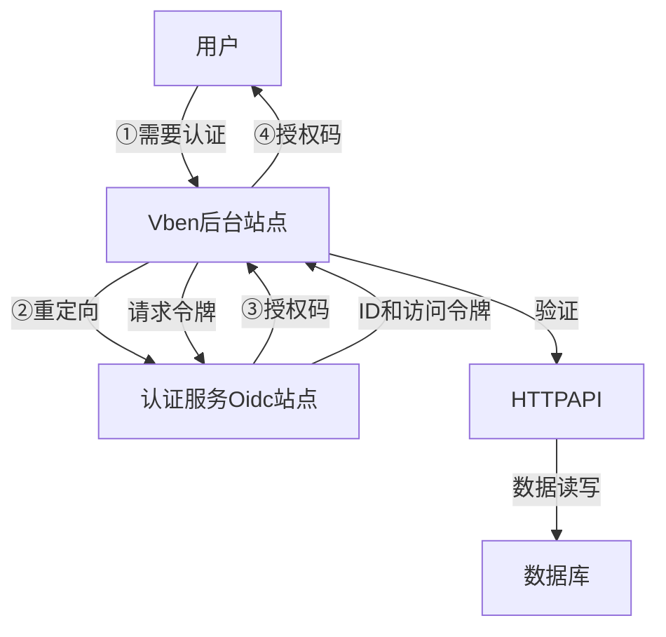
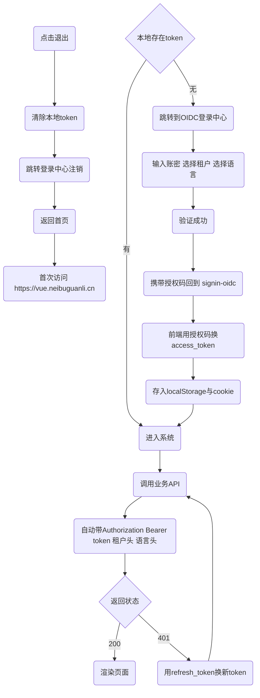

### 一、总体目标

Vue-Vben-Admin v5（域名：https://vben.neibuguanli.cn），完整对接ABP后端，跑通以下基础功能：

#### 1. OIDC-PKCE 登录 / 刷新令牌 / 401 自动刷新  

#### 2. 租户下拉切换（自动带 `__tenant` 头）  

#### 3. 动态左侧菜单（ABP `/api/abp/application-configuration`）  

#### 4. 按钮级权限（`v-auth` 指令）  

#### 5. 多语言（ABP `/api/language-management/languages`）  

#### 6. 主题/布局/锁屏/404/500 等走查

```typescript
const params = new URLSearchParams(location.search);
const code = params.get('code');
const verifier = localStorage.getItem('code_verifier');

const body = new URLSearchParams({
  grant_type: 'authorization_code',
  client_id: 'XShop_Arco',
  code: code!,
  redirect_uri: 'https://arco.f2b2c.shop/signin-oidc',
  code_verifier: verifier!
});

fetch('https://openid.f2b2c.shop/connect/token', {
  method: 'POST',
  headers: { 'Content-Type': 'application/x-www-form-urlencoded' },
  body
})
.then(r => r.json())
.then(tok => {
  localStorage.setItem('access_token', tok.access_token);
  localStorage.setItem('refresh_token', tok.refresh_token);
  history.replace('/');   // 回到首页
});
```

### 二、前端与授权站点和API站点的交互

#### 1、用户认证流程




#### 2、前端交互流程





#### 3、前端交互细节

注意：vben站点需要传递clientId给授权站点（clientId：ProjectAdmin_Vben_App）

````mermaid
graph TD
    %% 颜色标记：绿色=成功，红色=失败/异常，灰色=可选
    A[用户访问 https://vue.neibuguanli.cn] --> B{本地存在access_token?}
    B -->|无| C[302 重定向至<br>https://oidc.neibuguanli.cn/connect/authorize?...<br>携带client_id=ProjectAdmin_Vben_App<br>&redirect_uri=https://vue.neibuguanli.cn/signin-oidc<br>&response_type=code id_token<br>&scope=openid profile roles email phone Admin<br>&__tenant=租户ID<br>&ui_locales=zh-CN]
    B -->|有| D[携带令牌调用API]

    C --> E[授权中心登录页<br>https://oidc.neibuguanli.cn/Account/Login]
    E --> F[用户填写账密/租户/语言]
    F --> G[POST /Account/Login]
    G --> H[验证通过]
    H --> I[302 重定向回<br>https://vue.neibuguanli.cn/signin-oidc<br>form_post 方式<br>携带code & id_token & state]
    I --> J[Vue后端接收<br>id_token & code & state]
    J --> K[验证state]
    K --> L[保存id_token到cookie/local]
    L --> M[使用code换access_token<br>POST /connect/token<br>Header: Content-Type: application/x-www-form-urlencoded<br>Body: grant_type=authorization_code<br>&code=CODE<br>&client_id=ProjectAdmin_Vben_App<br>&code_verifier=xxx]
    M --> N[得到 access_token<br>refresh_token]
    N --> O[保存access_token到cookie/local]
    O --> D

    D --> P[请求API<br>https://api.neibuguanli.cn/...]
    P --> Q[请求头携带<br>Authorization: Bearer access_token<br>__tenant: 租户ID<br>Accept-Language: zh-CN]
    Q --> R{令牌有效?}
    R -->|有效| S[返回200业务数据]
    R -->|过期| T[用refresh_token换AT<br>POST /connect/token<br>grant_type=refresh_token<br>&refresh_token=RT]
    T --> U[更新access_token]
    U --> D

    V[用户点击注销] --> W[清除本地token]
    W --> X[302 跳转<br>https://oidc.neibuguanli.cn/connect/logout?<br>id_token_hint=IT<br>&post_logout_redirect_uri=https://vue.neibuguanli.cn/signout-callback-oidc<br>&state=xyz]
    X --> Y[授权中心清除会话]
    Y --> Z[302 回到<br>https://vue.neibuguanli.cn/signout-callback-oidc?state=xyz]
    Z --> A
```
````


#### 4、自有登录页与oidc授权码流的对比

简单起见，先使用跳转授权站点的方式来完成登录认证

| **对比项**    | **跳转授权站点（PKCE）**                     | **Vben 自有页面（直接登录）**             |
| ------------- | -------------------------------------------- | ----------------------------------------- |
| 用户体验      | 跳走 → 登录中心 → 跳回；地址栏可见变化       | 全程留在 Vben 页面，无跳转                |
| 协议流        | 授权码流（Authorization Code + PKCE）        | 资源所有者密码流（ROPC）                  |
| 前端实现      | 用 `oidc-client-ts` 做重定向、回调、静默刷新 | 用 axios 直接调 `/api/account/login` 即可 |
| 安全等级      | 高（token 只在后端交互，前端无密码）         | 中等（密码经过前端，需 HTTPS+防 XSS）     |
| 刷新/退出     | 标准 `/connect/token` & `/connect/logout`    | 自定义 `/api/account/refresh` & `/logout` |
| 多租户/多语言 | 通过 authorize URL 参数传递                  | 通过 login/refresh 请求体 Header 传递     |

#### 5、接入菜单

```typescript
apps/vben5/src
├─views/admin
│  ├─identity
│  │  ├─user
│  │  ├─role
│  │  ├─ou
│  │  ├─claim
│  │  └─security-log
│  ├─openiddict
│  │  ├─application
│  │  └─scope
│  ├─language
│  ├─text-template
│  ├─audit
│  ├─setting
│  └─saas
│      ├─tenant
│      └─edition
├─api/        # 按模块拆 service
│  ├─identity.ts
│  ├─openiddict.ts
│  ├─language.ts
│  ├─audit.ts
│  ├─setting.ts
│  └─saas.ts
├─hooks/abp/  # 通用 CRUD Hook
│  └─useAbpCrud.ts
```


### 三、常见坑速查表

| **现象**        | **原因**                               | **解决**                                 |
| --------------- | -------------------------------------- | ---------------------------------------- |
| 列表无数据      | 只取 `res.data` 没取 `res.data.result` | 统一走 `abp.ts` 拦截器                   |
| 树表无 children | 扁平权限                               | 后端加 `children` 或前端递归             |
| 403 租户不匹配  | 缺 `__tenant` 头                       | 请求拦截统一加                           |
| OIDC 死循环     | 刷新失败仍重试                         | 401 刷新失败立即 `signoutRedirect`       |
| 编辑 400        | ABP 大小写敏感                         | `name` → `Name`，用后端 DTO 生成 TS 类型 |